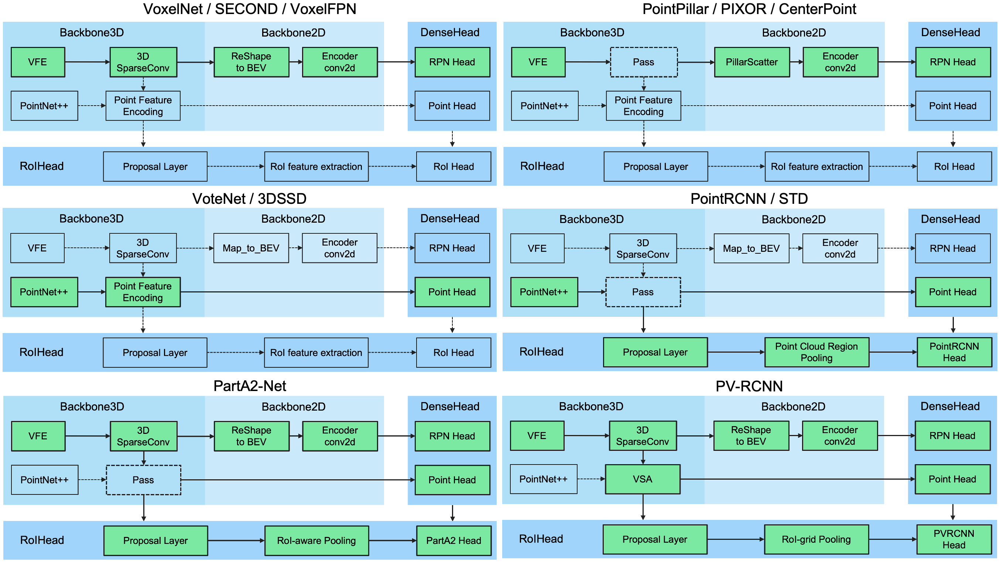

# Explanation Concentration (XC)
Explanation Concentration (XC) measures the concentration of attributions within a predicted object.

Before going through the instructions on running the XC experiments, make sure you are familiar with OpenPCDet's original repo first.
At least learn how to train and test a model, know where the resulting model and evaluation
results are stored, and know where the model config files are.

## PointPillars models used for experiments

### Trained on KITTI
[kitti_model1](https://drive.google.com/file/d/1wMxWTpU1qUoY3DsCH31WJmvJxcjFXKlm/view?usp=sharing)

[kitti_model2](https://drive.google.com/file/d/144oRybbNtKqTm26J2Ym-Jxq4JEwyBsp2/view?usp=sharing)

[kitti_model3](https://drive.google.com/file/d/1zs8iPyNVnjGzsy-89dgxGImbN3cd_dqr/view?usp=sharing)

### Trained on Waymo
[waymo_model](https://drive.google.com/file/d/1dhpgmOXcZm-Ilu7-iBWvVGVE3U-2mhG5/view?usp=sharing)

## Obtaining box-wise features from a model
You may skip this section if you want to just use the provided csv files to reproduce evaluation metrics presented in the paper.

### Obtaining XC values and top class score on a validation set
- If you haven't done so, create the following path in your local repo: `output/kitti_models/pointpillar_xai/`.
- Go to `tools/attr_experiment.py`.
- Follow instructions in comment, indicate the `method`, `attr_shown`, and `aggre_method` variables.
- Depending on how you set these variables, the XC values would be coming from Integrated Gradients (IG) or backprop, positive or negative attributions, obtained by summing or counting.
- Specify the `model_cfg_file` variable, this is where you stored the config file for the model.
- Specify the `model_ckpt` variable, this is where you stored the model checkpoint file you downloaded.
- If you do not wish to compute XC for all predicted boxes on the dataset, then you can set `check_all` to `False` and set `num_batches` to the number of frames you want to run the script on. Otherwise, leave them as default values.
- `cd tools`
- `python attr_experiments.py`
- Then you should see a new `csv` file being created in `output/kitti_models/pointpillar_xai/default`
- It contains the frame id (`batch`), tp/fp label (`tp/fp`), object class label (`pred_label`), top class score (`pred_score`), and the XC value (`xc`) for each predicted box.
- The process for obtaining values from a model trained on Waymo is the same, except that the `csv` file will be placed in `output/waymo_models/<model_config_name>/default`

### Obtaining number of points and distance to sensor on a validation set
- Go to `tools/get_pts_dist.py`.
- Specify the `model_ckpt` variable, this is where you stored the model checkpoint file you downloaded.
- Specify the `model_cfg_file` variable, this is where you stored the config file for the model.
- `cd tools`
- `python attr_experiments.py`
- Then you should see a new `csv` file being created in `output/kitti_models/pointpillar_xai/default`
- It contains the frame id (`batch`), tp/fp label (`tp/fp`), object class label (`pred_label`), top class score (`pred_score`), the distance to sensor (`dist`), and number of points (`pts`).

### Separating the TP and FP instances
- If you haven't done so, create a folder named `XAI_results` within the `tools` folder.
- In the `XAI_results` folder, create a subdirectory and put a previously generated `csv` file there (the one containing top class socre, class label, xc, number of points etc. for prediction boxes).
- Go to `tools/split_tp_fp.py`.
- Specify the `source_dir` (directory where you stored the csv file) and `file_name` (csv file name) variables.
- Redefined the `field_names` and `data_dict` variable to match field names in the csv file.
- `python split_tp_fp.py`
- You should now have the TP and FP data split into 2 csv files.

## CSV files with box-wise features
The csv files containing predicted label, top class score, 4 XC scores from backprop, number of points, distance to sensor for each of the 
predicted box generated by the PointPillars models trained on KITTI are available here:

[kitti_model1_csv](https://drive.google.com/drive/folders/1EXk4PsT9K5DFc20NUJovbx7dD2kjJ5qE?usp=sharing)

[kitti_model2_csv](https://drive.google.com/drive/folders/1u_ylaicDT6fx_BahcJmHwO2KnwVRQPGC?usp=sharing)

[kitti_model3_csv](https://drive.google.com/drive/folders/1nnIV57N9IYcn_SIb0qYsNJN4ICpK4B9u?usp=sharing)

- In each link, you will see the data for TP and FP samples are separated.
- If you haven't done so, create a folder named `XAI_results` within the `tools` folder.
- In the `XAI_results` folder, create a subdirectory and put the files in one of the above links in it.

The XC scores for IG and all XC scores generated from Waymo were scattered across multiple files, we will make them available after we organize them better.

## Generating histograms and CDF plots for TP and FP XC values
- Go to `tools/xc_hist.py`
- Change `XC_term` to one of the 4 XC scores, make sure it matches the name in the XC file header.
- `python xc_hist.py --XC_path where\you\saved\theCSVfiles\containing\tp_and_fp\data --pick_class <class_id>`
- The class id can be 0-car, 1-pedestrian, 2-cyclist. For Waymo, 0 represents the vehicle class.
- Then the histogram for the desired class will be generated in a new folder in `XAI_results`.

## Evaluate box-wise features for TP vs. FP classification
- If you haven't done so, create a folder named `XAI_results` within the `tools` folder.
- In the `XAI_results` folder, create a subdirectory
- Go to `tools/xc_eval_simple.py`.
- Specify `dist_n_pts`, `XC_only`, `skip_xc` as needed, following instructions in comments.
- Specify `dataset_name` as "KITTI" or "WAYMO".
- `python xc_eval_simple.py --XC_path where\you\saved\theCSVfiles\containing\tp_and_fp\data`.
- You should see a new folder created within the `XAI_results` directory, it will contain AUROC, AUPR, AUPR_op of the specific features evaluated on each object class.

## Combining top class score with XC scores
- Go to `binary_cls.py`.
- Specify the `interested_class`.
- Go to the `MLP` class and modify the number of input features if necessary.
- Change the `n_features` to match the number of features you plan to use.
- For the `new_df` variable, specify the name of features you plan to use.
- `python binary_cls.py --XQ_path where\you\saved\theCSVfiles\containing\tp_and_fp\data`.
- You should see results (accuracy, AUROC, AUPR, AUPR_op) printed in the terminal. 

The following is the README.md from OpenPCDet:


# OpenPCDet

`OpenPCDet` is a clear, simple, self-contained open source project for LiDAR-based 3D object detection. 

It is also the official code release of [`[PointRCNN]`](https://arxiv.org/abs/1812.04244), [`[Part-A^2 net]`](https://arxiv.org/abs/1907.03670) and [`[PV-RCNN]`](https://arxiv.org/abs/1912.13192). 


## Overview
- [Changelog](#changelog)
- [Design Pattern](#openpcdet-design-pattern)
- [Model Zoo](#model-zoo)
- [Installation](docs/INSTALL.md)
- [Quick Demo](docs/DEMO.md)
- [Getting Started](docs/GETTING_STARTED.md)
- [Citation](#citation)


## Changelog
[2020-08-10] **NEW:** Bugfixed: The provided NuScenes models have been updated to fix the loading bugs. Please redownload it if you need to use the pretrained NuScenes models.

[2020-07-30] **NEW:** `OpenPCDet` v0.3.0 is released with the following features:
   * The Point-based and Anchor-Free models ([`PointRCNN`](#KITTI-3D-Object-Detection-Baselines), [`PartA2-Free`](#KITTI-3D-Object-Detection-Baselines)) are supported now.
   * The NuScenes dataset is supported with strong baseline results ([`SECOND-MultiHead (CBGS)`](#NuScenes-3D-Object-Detection-Baselines) and [`PointPillar-MultiHead`](#NuScenes-3D-Object-Detection-Baselines)).
   * High efficiency than last version, support `PyTorch 1.1~1.5` and `spconv 1.0~1.2` simultaneously.
   
[2020-07-17]  Add simple visualization codes and a quick demo to test with custom data. 

[2020-06-24] `OpenPCDet` v0.2.0 is released with pretty new structures to support more models and datasets. 

[2020-03-16] `OpenPCDet` v0.1.0 is released. 


## Introduction


### What does `OpenPCDet` toolbox do?

Note that we have upgrated `PCDet` from `v0.1` to `v0.2` with pretty new structures to support various datasets and models.

`OpenPCDet` is a general PyTorch-based codebase for 3D object detection from point cloud. 
It currently supports multiple state-of-the-art 3D object detection methods with highly refactored codes for both one-stage and two-stage 3D detection frameworks.

Based on `OpenPCDet` toolbox, we win the Waymo Open Dataset challenge in [3D Detection](https://waymo.com/open/challenges/3d-detection/), 
[3D Tracking](https://waymo.com/open/challenges/3d-tracking/), [Domain Adaptation](https://waymo.com/open/challenges/domain-adaptation/) 
three tracks among all LiDAR-only methods, and the Waymo related models will be released to `OpenPCDet` soon.    

We are actively updating this repo currently, and more datasets and models will be supported soon. 
Contributions are also welcomed. 

### `OpenPCDet` design pattern

* Data-Model separation with unified point cloud coordinate for easily extending to custom datasets:
<p align="center">
  
</p>

* Unified 3D box definition: (x, y, z, dx, dy, dz, heading).

* Flexible and clear model structure to easily support various 3D detection models: 
<p align="center">
  
</p>

* Support various models within one framework as: 
<p align="center">
  
</p>


### Currently Supported Features

- [x] Support both one-stage and two-stage 3D object detection frameworks
- [x] Support distributed training & testing with multiple GPUs and multiple machines
- [x] Support multiple heads on different scales to detect different classes
- [x] Support stacked version set abstraction to encode various number of points in different scenes
- [x] Support Adaptive Training Sample Selection (ATSS) for target assignment
- [x] Support RoI-aware point cloud pooling & RoI-grid point cloud pooling
- [x] Support GPU version 3D IoU calculation and rotated NMS 


## Model Zoo

### KITTI 3D Object Detection Baselines
Selected supported methods are shown in the below table. The results are the 3D detection performance of moderate difficulty on the *val* set of KITTI dataset.
* All models are trained with 8 GTX 1080Ti GPUs and are available for download. 
* The training time is measured with 8 TITAN XP GPUs and PyTorch 1.5.

|                                             | training time | Car | Pedestrian | Cyclist  | download | 
|---------------------------------------------|----------:|:-------:|:-------:|:-------:|:---------:|
| [PointPillar](tools/cfgs/kitti_models/pointpillar.yaml) |~1.2 hours| 77.28 | 52.29 | 62.68 | [model-18M](https://drive.google.com/file/d/1wMxWTpU1qUoY3DsCH31WJmvJxcjFXKlm/view?usp=sharing) | 
| [SECOND](tools/cfgs/kitti_models/second.yaml)       |  ~1.7 hours  | 78.62 | 52.98 | 67.15 | [model-20M](https://drive.google.com/file/d/1-01zsPOsqanZQqIIyy7FpNXStL3y4jdR/view?usp=sharing) |
| [PointRCNN](tools/cfgs/kitti_models/pointrcnn.yaml) | ~3 hours | 78.70 | 54.41 | 72.11 | [model-16M](https://drive.google.com/file/d/1BCX9wMn-GYAfSOPpyxf6Iv6fc0qKLSiU/view?usp=sharing)| 
| [PointRCNN-IoU](tools/cfgs/kitti_models/pointrcnn_iou.yaml) | ~3 hours | 78.75 | 58.32 | 71.34 | [model-16M](https://drive.google.com/file/d/1V0vNZ3lAHpEEt0MlT80eL2f41K2tHm_D/view?usp=sharing)|
| [Part-A^2-Free](tools/cfgs/kitti_models/PartA2_free.yaml)   | ~3.8 hours| 78.72 | 65.99 | 74.29 | [model-226M](https://drive.google.com/file/d/1lcUUxF8mJgZ_e-tZhP1XNQtTBuC-R0zr/view?usp=sharing) |
| [Part-A^2-Anchor](tools/cfgs/kitti_models/PartA2.yaml)    | ~4.3 hours| 79.40 | 60.05 | 69.90 | [model-244M](https://drive.google.com/file/d/10GK1aCkLqxGNeX3lVu8cLZyE0G8002hY/view?usp=sharing) |
| [PV-RCNN](tools/cfgs/kitti_models/pv_rcnn.yaml) | ~5 hours| 83.61 | 57.90 | 70.47 | [model-50M](https://drive.google.com/file/d/1lIOq4Hxr0W3qsX83ilQv0nk1Cls6KAr-/view?usp=sharing) |

### NuScenes 3D Object Detection Baselines
All models are trained with 8 GTX 1080Ti GPUs and are available for download.

|                                             | mATE | mASE | mAOE | mAVE | mAAE | mAP | NDS | download | 
|---------------------------------------------|----------:|:-------:|:-------:|:-------:|:---------:|:-------:|:-------:|:---------:|
| [PointPillar-MultiHead](tools/cfgs/nuscenes_models/cbgs_pp_multihead.yaml) | 33.87	| 26.00 | 32.07	| 28.74 | 20.15 | 44.63 | 58.23	 | [model-23M](https://drive.google.com/file/d/1p-501mTWsq0G9RzroTWSXreIMyTUUpBM/view?usp=sharing) | 
| [SECOND-MultiHead (CBGS)](tools/cfgs/nuscenes_models/cbgs_second_multihead.yaml) | 31.15 |	25.51 |	26.64 | 26.26 | 20.46 | 50.59 | 62.29 | [model-35M](https://drive.google.com/file/d/1bNzcOnE3u9iooBFMk2xK7HqhdeQ_nwTq/view?usp=sharing) |


### Other datasets
More datasets are on the way. 

## Installation

Please refer to [INSTALL.md](docs/INSTALL.md) for the installation of `OpenPCDet`.


## Quick Demo
Please refer to [DEMO.md](docs/DEMO.md) for a quick demo to test with a pretrained model and 
visualize the predicted results on your custom data or the original KITTI data.

## Getting Started

Please refer to [GETTING_STARTED.md](docs/GETTING_STARTED.md) to learn more usage about this project.


## License

`OpenPCDet` is released under the [Apache 2.0 license](LICENSE).

## Acknowledgement
`OpenPCDet` is an open source project for LiDAR-based 3D scene perception that supports multiple
LiDAR-based perception models as shown above. Some parts of `PCDet` are learned from the official released codes of the above supported methods. 
We would like to thank for their proposed methods and the official implementation.   

We hope that this repo could serve as a strong and flexible codebase to benefit the research community by speeding up the process of reimplementing previous works and/or developing new methods.


## Citation 
If you find this project useful in your research, please consider cite:


```
@inproceedings{shi2020pv,
  title={Pv-rcnn: Point-voxel feature set abstraction for 3d object detection},
  author={Shi, Shaoshuai and Guo, Chaoxu and Jiang, Li and Wang, Zhe and Shi, Jianping and Wang, Xiaogang and Li, Hongsheng},
  booktitle={Proceedings of the IEEE/CVF Conference on Computer Vision and Pattern Recognition},
  pages={10529--10538},
  year={2020}
}


@article{shi2020points,
  title={From Points to Parts: 3D Object Detection from Point Cloud with Part-aware and Part-aggregation Network},
  author={Shi, Shaoshuai and Wang, Zhe and Shi, Jianping and Wang, Xiaogang and Li, Hongsheng},
  journal={IEEE Transactions on Pattern Analysis and Machine Intelligence},
  year={2020},
  publisher={IEEE}
}

@inproceedings{shi2019pointrcnn,
  title={PointRCNN: 3d Object Progposal Generation and Detection from Point Cloud},
  author={Shi, Shaoshuai and Wang, Xiaogang and Li, Hongsheng},
  booktitle={Proceedings of the IEEE Conference on Computer Vision and Pattern Recognition},
  pages={770--779},
  year={2019}
}
```

## Contact
This project is currently maintained by Shaoshuai Shi ([@sshaoshuai](http://github.com/sshaoshuai)) and Chaoxu Guo ([@Gus-Guo](https://github.com/Gus-Guo)).
